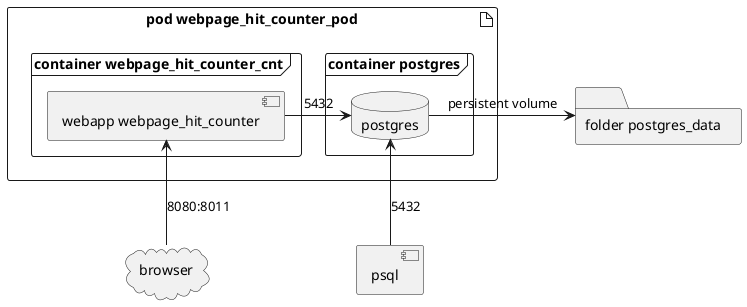
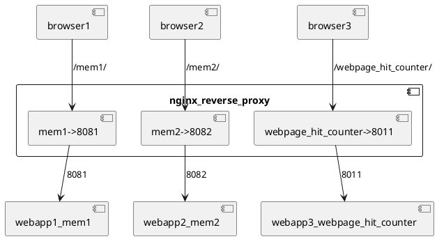

# deploying_rust_server_and_database

**06. Tutorial on how to deploy Rust Web Server and Database (deploying_rust_server_and_database) (2022-08)**  
***version: 1.0  date: 2022-08-12 author: [bestia.dev](https://bestia.dev) repository: [GitHub](https://github.com/bestia-dev/deploying_rust_server_and_database)***  

 

 [](https://github.com/bestia-dev/deploying_rust_server_and_database/)
 [](https://github.com/bestia-dev/deploying_rust_server_and_database/)

 [](https://github.com/bestia-dev/deploying_rust_server_and_database/blob/master/LICENSE)
 

Hashtags: #rustlang #buildtool #developmenttool #tutorial #docker #ssh  
My projects on Github are more like a tutorial than a finished product: [bestia-dev tutorials](https://github.com/bestia-dev/tutorials_rust_wasm).

## Intro

Welcome to bestia.dev !  
Learning Rust and Wasm programming and having fun.  
I just love  programming !  

In my [fifth tutorial](https://bestia.dev/youtube/sort_text_international_rust_wasm_pwa.html) of the series ["bestia.dev Tutorials for Rust programming language",](https://www.youtube.com/playlist?list=PLbXDHfG-c3U8pkyN1D7SwF3ItA3uTyoWW) I created a simple web application "webpage_hit_counter".
It works fine on my local [Rust development environment inside a docker container](https://bestia.dev/youtube/win10_wsl2_debian11.html).
Now I want to deploy it to the Cloud.  
The code for deployment is part of the [webpage_hit_counter](https://github.com/bestia-dev/webpage_hit_counter) project.

This project has also a youtube video tutorial. Watch it:
<!-- markdownlint-disable MD033 -->
[](https://bestia.dev/youtube/deploying_rust_server_and_database.html)
<!-- markdownlint-enable MD033 -->

## Google Cloud VM free tier

I have one VM Engine on GoogleCloud. It is really small, but unbeatably cheap - free tier.  
<https://cloud.google.com/free>  
Services included in the free tier us-west1-b (Oregon):  

- Compute engine E2-micro core (before discount 3.85€)  
    E2 shared-core machines have fractional vCPUs - 25% of one CPU core  
- E2 ram (before discount 2.06€)  
- Total 0.00€  

I access the VM over SSH from my WSL Debian bash terminal.  
Then it opens the Linux bash terminal of the VM where I manage everything.  
No GUI is needed. It is just a server!  

Run ssh to connect to the Google VM bash in my terminal:

```bash
ssh -i ~/.ssh/ssh_certificate username@domain -v
```

Debian version:

```bash
lsb_release -a
   11 bullseye  
```

Update and upgrade:  

```bash
sudo apt -y update && sudo apt -y upgrade
```

maybe I need to reboot? No need. Good.  
How much space do I have on my limited small VM disk 10 GB?

```bash
df -h
   /dev/sda1       9.8G  6.1G  3.2G  66% /
```

Clean some space:

```bash
sudo apt-get clean
```

Now I have a little more space:

```bash
df -h
   /dev/sda1       9.8G  5.4G  3.9G  58% /
```

## Uninstall docker

I will uninstall docker because I will use Podman instead. Podman is an in-place replacement for Docker. It is not a service, just a simple executable.  
<https://podman.io/>  
On my VM I didn't really use any containers before, I was just experimenting with docker, so I don't care if I delete everything: images, containers, volumes,...

```bash
dpkg -l | grep -i docker
sudo apt-get purge -y docker-engine docker docker.io docker-ce docker-ce-cli
sudo apt-get autoremove -y --purge docker-engine docker docker.io docker-ce  
sudo rm -rf /var/lib/docker /etc/docker
sudo rm /etc/apparmor.d/docker
sudo groupdel docker
sudo rm -rf /var/run/docker.sock
df -h
   /dev/sda1       9.8G  5.0G  4.3G  54% /
```

## Install Podman

Installing Podman is super easy on Debian 11.

```bash
sudo apt install podman  

podman --version
   podman version 3.0.1
df -h
   /dev/sda1       9.8G  5.1G  4.2G  56% /
```

## Pull and run the Postgres container

For now, we will not deep dive into security. We will do that later.  
We need a local directory to persist the data of the Postgres server. It is not good to have the data inside the container. Then the data will be deleted if the container is removed. And that will happen eventually. Containers are ephemeral, they can be deleted at any time.  
<https://techviewleo.com/how-to-run-postgresql-in-podman-container/>  

```bash
mkdir -p /home/luciano_bestia/postgres_data/webpage_hit_counter_pod

podman pull docker.io/library/postgres:13

podman run --name postgresql -d \
  -e POSTGRES_USER=admin \
  -e POSTGRES_PASSWORD=Passw0rd \
  -p 5432:5432 \
  -v /home/luciano_bestia/postgres_data/webpage_hit_counter_pod:/var/lib/postgresql/data \
  docker.io/library/postgres:13

podman ps
   CONTAINER ID  IMAGE                          COMMAND   CREATED       STATUS           PORTS                   NAMES
   24ff633d6004  docker.io/library/postgres:13  postgres  19 hours ago  Up 19 hours ago  0.0.0.0:5432->5432/tcp  postgresql
df -h
   /dev/sda1       9.8G  5.6G  3.8G  60% /
podman logs postgresql
   2022-08-11 13:48:31.304 UTC [1] LOG:  database system is ready to accept connections
```

## Install psql client

I will install the psql utility to work with the Postgres server.  

```bash
sudo apt install -y postgresql-client
psql --version
   psql (PostgreSQL) 13.7 (Debian 13.7-0+deb11u1)

#Connect to the postgres server in the container:
psql -h localhost -p 5432 -U admin -W
   Password: ***

#In psql list of databases:  
\l
#Change active database
\c
#List of tables
\dt
#Quit the psql
\q
```

## Backup and restore database

I will back up the database on my development Postgres server and restore it on the VM.  
This is a skill every database developer must know.  
In the VSCode terminal of the project webpage_hit_counter run:

```bash
pg_dump -F t -U admin -h localhost webpage_hit_counter > deploy/webpage_hit_counter_backup.tar
ls -l deploy
   12K webpage_hit_counter_backup.tar


#I can use ssh and sync to copy the file to the server:
rsync -e ssh -a --info=progress2 deploy/webpage_hit_counter_backup.tar luciano_bestia@bestia.dev:/var/www/transfer_folder/webpage_hit_counter/
```

Now on the VM server, I need to restore it:

```bash
cd /var/www/transfer_folder/webpage_hit_counter
pg_restore -C -v -d postgres -U admin -h localhost ./webpage_hit_counter_backup.tar

#Try it:
psql -h localhost -p 5432 -U admin -W -d webpage_hit_counter
#In psql list of databases:  
\l
    webpage_hit_counter | admin | UTF8     | en_US.utf8 | en_US.utf8 |

select * from webpage;
      id   | webpage
    --------+---------
    555555 | test
    777777 | test2
    (2 rows)

#We can check, that the data is stored outside the container:
sudo ls -l ~/postgres_data/webpage_hit_counter_pod
```

Excellent!

## Delete the container

We will not use this Postgres container. It was only for testing. We will create a new pod with a new container.  
We can remove this container now. The data will persist on the system disk.

```bash
podman ps

podman rm -f postgresql
```

## Deploy the Rust web server

I have many small and simple web applications on my Google VM.  
Now that I have Podman installed, I will put the webpage_hit_counter application in a container. I want to isolate the applications.  
From my Rust development container, I will upload a few files to my Google VM in the folder `/var/www/transfer_folder`.  
There I will run the bash script to create the container image `sh buildah_image_webpage_hit_counter.sh`.  
I will create the container image with `buildah`. This is the Podman utility for creating images.
The binary executable file `target/release/webpage_hit_counter` and the dotenv file must be in the same directory where the bash script is run.  
Note that the size of the binary can vary enormously. In build debug mode it is 135MB, in build release mode is 10MB. On that, I use the `strip` command and it is now 5MB in size.  
I upload files to my Google VM using rsync and SSH. I coded this in the automation task `cargo auto publish_to_web` of the project `webpage_hit_counter`.




## create Podman image and pod

We can now connect the terminal to my Google VM bash over SSH:

```bash
ssh -i ~/.ssh/ssh_certificate username@domain -v
```

Run the bash script to create the image:

```bash
cd /var/www/transfer_folder/webpage_hit_counter
sh buildah_image_webpage_hit_counter.sh

podman images
   REPOSITORY                                   TAG         IMAGE ID      CREATED       SIZE
   localhost/webpage_hit_counter_img  2022-08-09  7b24309a1205  25 hours ago  110 MB
   docker.io/library/postgres                   13          2990fc2bd747  9 days ago    381 MB
```

Now create and run the pod. This will also run the web app.

```bash
sh webpage_hit_counter_pod_create.sh

podman pod ls
   POD ID        NAME                     STATUS    CREATED       INFRA ID      # OF CONTAINERS
   54e7fff2c232  webpage_hit_counter_pod  Running   1 minute ago  e279afe30b48  3
```

## Check the Postgres server

Check the Postgres server with psql:

```bash
psql -h localhost -p 5432 -U admin -W -d webpage_hit_counter

#List the databases
\l
   webpage_hit_counter | admin | UTF8     | en_US.utf8 | en_US.utf8 |

select * from webpage;
      id   | webpage
   --------+---------
   555555 | test
   777777 | test2
   (2 rows)

select * from hit_counter;
   id | webpage_id | count
   ----+------------+-------
   4 |     777777 |    35
   1 |     555555 |    29
   (2 rows)
```

## check the web application container

The bash script already started the web application in detached mode.

We can see the std output with:

```bash
podman logs webpage_hit_counter_cnt
```

The application listens to port 8080, but this port is already in use on my Google VM. Containers can easily forward ports, so we can easily change the port to 8011.

```bash
curl http://localhost:8011/webpage_hit_counter/get_svg_image/555555.svg
```

It works!

## Repetition is the mother of learning

Now that everything is configured it is very easy to deploy any web server plus database application.

In VSCode, terminal of project webpage_hit_counter  
Build a new release `cargo auto release`.  
Publish to web `cargo auto publish_to_web`.  

On the Google VM bash terminal:

```bash
#remove pod
podman pod rm -f webpage_hit_counter_pod
cd /var/www/transfer_folder/webpage_hit_counter
#create container image
sh buildah_image_webpage_hit_counter.sh
#create and run the pod
sh webpage_hit_counter_pod_create.sh
#test
curl http://localhost:8011/webpage_hit_counter/get_svg_image/555555.svg
```

Done! It works!

## Nginx reverse proxy

On my public IP address, I attached the Nginx server. I use it as a reverse proxy.  
It receives requests on the https port 443 and then routes them internally to my web apps.  
I have many web apps, each one is listening on a different port on localhost.  
If the route starts with `/webpage_hit_counter/` then the Nginx will process it and turn it into a `localhost:8011` request.




In the file `/etc/nginx/sites-available/default` I append these config lines:

```nginx
#region webpage_hit_counter
   # only complete route with trailing slash works
   # the trailing / after both of these lines means this route is not appended to the forwarding
   location /webpage_hit_counter/ {
      proxy_pass http://127.0.0.1:8011/webpage_hit_counter/;
      proxy_buffering off;
   }
#endregion webpage_hit_counter
```

Gracefully reload NGINX web server to read the modified config files:

```bash
sudo systemctl reload nginx

#Try it in browser or with curl:
curl https://bestia.dev/webpage_hit_counter/get_svg_image/555555.svg
```

It works like a charm!

## My webpages and hit_counts

I already have a hit_counter on my web pages. I want to replace it with my project webpage_hit_counter.  
I will start with my webpage `bestia.dev` it has 273 hits.  
The old img element was like this:

```html

```

My new counter will have a random id number:

```html

```

Let's insert the data in the database:

```bash
psql -h localhost -p 5432 -U admin -W -d webpage_hit_counter

insert into webpage(id, webpage) values(546994039, 'bestia.dev');

insert into hit_counter(webpage_id, count) values(546994039, 273);
```

Check the bestia.dev page. It shows the hit_counter.  
Refresh it and it is incremented.  
Fantastic!  
I can now repeat this for all my other pages.

## Check all my hit counts

In psql I can now see the hit counters of all of my webpages.  

```psql
select W.webpage, H.count from hit_counter H join webpage W on W.id=H.webpage_id order by H.count desc;
```

## Open-source and free as a beer

My open-source projects are free as a beer (MIT license).  
I just love programming.  
But I need also to drink. If you find my projects and tutorials helpful, please buy me a beer by donating to my [PayPal](https://paypal.me/LucianoBestia).  
You know the price of a beer in your local bar ;-)  
So I can drink a free beer for your health :-)  
[Na zdravje!](https://translate.google.com/?hl=en&sl=sl&tl=en&text=Na%20zdravje&op=translate) [Alla salute!](https://dictionary.cambridge.org/dictionary/italian-english/alla-salute) [Prost!](https://dictionary.cambridge.org/dictionary/german-english/prost) [Nazdravlje!](https://matadornetwork.com/nights/how-to-say-cheers-in-50-languages/) 🍻

[//bestia.dev](https://bestia.dev)  
[//github.com/bestia-dev](https://github.com/bestia-dev)  
[//bestiadev.substack.com](https://bestiadev.substack.com)  
[//youtube.com/@bestia-dev-tutorials](https://youtube.com/@bestia-dev-tutorials)  
